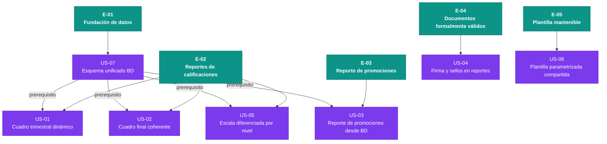

# Epics — Ciencia y Fe · Ciclo 2025-2026

> Fuente de verdad: `inbox/mvp-canvas.md`, `inbox/user-stories.md`,
> `inbox/requisitos.md`, `inbox/personas.md`, `inbox/evidence-map.json`.
> Toda épica traza a ítems del inbox. Nada aquí es invención.

---

## E-01 · Fundación de datos: esquema centralizado de calificaciones

**Valor (outcome):** El Desarrollador puede consultar cualquier calificación,
nombre de materia y período desde una única fuente de verdad en la BD, eliminando
la inconsistencia que hoy hace que corregir un reporte rompa otro.

**Origen:** R-07 · US-07 · `pain:inconsistencia-bd` (Rectora) ·
`pain:sp-no-mantenibles` (Desarrollador) · `pain:reportes-no-dinamicos`
(Desarrollador) · `mvp-canvas.md` (funcionalidad mínima 1, prerequisito de todo
lo demás)

**Prioridad:** 1 — prerequisito técnico bloqueante: sin esquema centralizado
ninguna otra épica puede leer datos coherentes.

**Historias:** US-07

---

## E-02 · Reportes de calificaciones correctos en el primer intento

**Valor (outcome):** La Secretaria genera cuadros trimestrales, quimestrales y
finales con nombres de materias desde la BD y escalas correctas por nivel, y los
envía al distrito sin devoluciones por errores de nomenclatura o inconsistencia
entre períodos.

**Origen:** R-01 · R-02 · R-05 · US-01 · US-02 · US-05 ·
`pain:materias-quemadas` (Secretaria) · `pain:documentos-urgentes-cierre-ano`
(Rectora) · `mvp-canvas.md` (outcome principal: "documentos de cierre aceptados
en el primer intento sin devolución por inconsistencias") · `mvp-canvas.md`
(funcionalidades mínimas 2 y 5)

**Prioridad:** 2 — es el núcleo de valor del MVP; sin cuadros correctos no se
cumple la métrica del 90 % de aceptación. Depende de E-01.

**Historias:** US-01, US-02, US-05

---

## E-03 · Reporte de promociones consistente con los cuadros de calificaciones

**Valor (outcome):** La Secretaria genera el reporte de promociones con los mismos
nombres de materias que aparecen en los cuadros de calificaciones, eliminando
las inconsistencias entre documentos entregados al distrito.

**Origen:** R-03 · US-03 · `pain:plantillas-word-quemadas-promociones`
(Secretaria) · `mvp-canvas.md` (funcionalidad mínima 3)

**Prioridad:** 3 — de alto valor para el cierre de año; depende de E-01 para
leer nombres de materias desde BD. Paralela a E-02 una vez E-01 completada,
pero de menor alcance.

**Historias:** US-03

---

## E-04 · Documentos formalmente válidos ante el distrito

**Valor (outcome):** La Secretaria entrega al distrito documentos con espacios
de firma del docente y sellos reglamentarios, evitando rechazos por
incumplimiento de requisitos formales.

**Origen:** R-04 · US-04 · `pain:documentos-urgentes-cierre-ano` (Rectora) ·
`mvp-canvas.md` (funcionalidad mínima 4)

**Prioridad:** 4 — bloqueante para la entrega formal, pero es el cambio de menor
riesgo técnico; puede desarrollarse en paralelo con E-02/E-03 una vez definida
la plantilla.

**Historias:** US-04

---

## E-05 · Plataforma de reportes mantenible: plantilla única parametrizada

**Valor (outcome):** El Desarrollador aplica un cambio de diseño o estructura
en un único lugar y este se propaga a todos los cursos, eliminando el esfuerzo
de modificar decenas de archivos RDLC o Word individuales.

**Origen:** R-06 · R-12 · US-06 · `pain:rdlc-por-curso` (Desarrollador) ·
`pain:reportes-no-dinamicos` (Desarrollador) · `mvp-canvas.md` (funcionalidad
mínima 6)

**Prioridad:** 5 — habilita la mantenibilidad futura y cierra la deuda técnica
de las plantillas por curso; valioso, pero no bloquea la entrega inmediata de
los reportes de cierre si se resuelven E-02 a E-04 con una plantilla compartida
desde el inicio.

**Historias:** US-06

---

## Justificación del orden de épicas

| Prioridad | Épica | Razón |
|-----------|-------|-------|
| 1 | E-01 Fundación de datos | Prerequisito técnico absoluto; sin esquema centralizado las demás épicas no tienen fuente de datos coherente |
| 2 | E-02 Reportes de calificaciones | Núcleo del outcome del MVP (métrica 90 %) y mayor volumen de dolores reportados (Secretaria + Rectora) |
| 3 | E-03 Reporte de promociones | Segundo documento de cierre crítico; comparte la misma urgencia que E-02 pero menor complejidad |
| 4 | E-04 Documentos formalmente válidos | Necesario para la entrega al distrito; bajo riesgo técnico, alta consecuencia formal |
| 5 | E-05 Plantilla mantenible | Reduce deuda técnica estructural; maximiza valor para el Desarrollador y la Rectora a largo plazo |

---

## Diagrama del backlog

> **Leyenda:** teal = épica · morado = historia candidata (pendiente de
> refinamiento completo por Developer) · verde = historia lista (ninguna
> alcanza este estado todavía; el gate DoR/INVEST lo confirmará).

---

## Preguntas abiertas (open questions)

Las siguientes preguntas no tienen respaldo en el inbox y deben resolverse antes
de que las historias correspondientes puedan considerarse listas para el sprint:

1. **Migración de datos históricos (R-07 / US-07):** ¿Existe un script de
   migración de calificaciones desde el esquema actual al centralizado, o se
   parte desde cero para el ciclo 2025-2026? El MVP Canvas menciona el supuesto
   de que "la BD actual puede migrarse sin pérdida de datos históricos", pero no
   hay evidencia de que se haya validado. (`mvp-canvas.md` — riesgos/supuestos)
2. **Escala de comportamiento (R-05 / US-05):** El requisito menciona "escalas
   de comportamiento configurables por nivel", pero no hay criterio de aceptación
   en US-05 ni evidencia de entrevista que defina los valores exactos.
3. **Formato de sellos (R-04 / US-04):** No hay evidencia de qué imagen o
   formato tienen los sellos del colegio y del distrito. ¿Se proveen como
   activos digitales o deben escanearse?
4. **Quimestral vs. trimestral (R-01 / US-01):** El canvas menciona ambos tipos,
   pero US-01 solo nombra el trimestral. ¿El cuadro quimestral es un tipo
   separado o un agregado de trimestrales? Impacta la estimación de US-01 y US-02.
