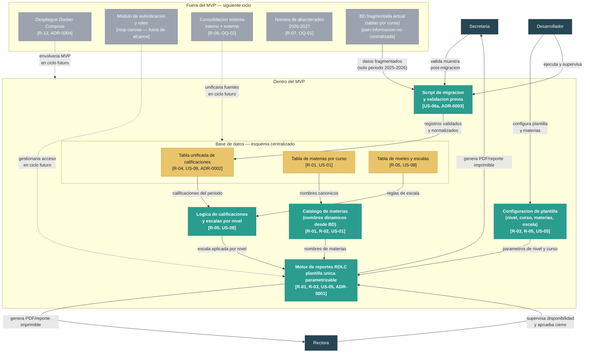

# Arquitectura — Ciencia y Fe

> Delivery: `cienciayfe`  
> Fecha: 2026-06-23  
> Responsable: Architect  
> Trazabilidad base: `inbox/mvp-canvas.md`, `inbox/requisitos.md`, `inbox/user-stories.md`, `inbox/personas.md`, `inbox/evidence-map.json`, `outputs/epics.md`, `outputs/backlog.json`, `outputs/stories.md`

---

## Contexto y restricciones

El módulo de reportes académicos de la institución Ciencia y Fe debe generar cuadros de calificaciones trimestrales, finales y reportes de promoción para el cierre del período 2025-2026, con cero devoluciones por inconsistencias de datos o layout (`mvp-canvas.md` · metrica-exito).

Las restricciones que dan forma a la arquitectura son:

1. **Equipo de dos personas con presión de plazo.** El delivery debe estar listo antes del cierre del período; no hay capacidad para explorar tecnologías nuevas (`mvp-canvas.md` · riesgos·2, `personas.md` · Rectora).
2. **Stack .NET existente con RDLC.** El sistema está construido sobre .NET y usa RDLC para reportes; el discovery no menciona alternativas evaluadas (`personas.md` · Desarrollador).
3. **Sin ambiente de staging formal.** La validación se realiza sobre copia local de producción (supuesto SA-01, `stories.md`).
4. **Infraestructura de despliegue no documentada.** El discovery menciona Docker como deseable pero no hay evidencia de soporte en la infraestructura actual (`requisitos.md` · R-13, `backlog.json` · OQ-05).
5. **Datos fragmentados en producción.** El esquema actual tiene tablas de calificaciones por curso con SPs de hasta 30 000 líneas; la migración es el riesgo principal (`personas.md` · Desarrollador, `mvp-canvas.md` · riesgos·1).

---

## Decisiones de arquitectura (resumen — los ADRs tienen el detalle)

| ADR | Decisión | Estado |
|-----|----------|--------|
| ADR-0001 | Mantener RDLC como motor de reportes y refactorizar hacia una plantilla única parametrizable | Aceptado |
| ADR-0002 | Tabla unificada de calificaciones (esquema centralizado) en lugar de tablas por curso | Aceptado |
| ADR-0003 | Migración incremental con validación en copia local antes de aplicar en producción | Aceptado |
| ADR-0004 | Diferir el despliegue con Docker Compose al siguiente ciclo (sin evidencia de soporte de infraestructura) | Propuesto |

---

## Diagrama de componentes

**Convenciones del diagrama:**
- Teal (`#2A9D8F`): componentes dentro del MVP.
- Amarillo (`#E9C46A`): base de datos (componentes de datos del MVP).
- Gris (`#9CA3AF`): componentes fuera del MVP, diferidos al siguiente ciclo.
- Negro (`#264653`): actores (personas del discovery).
- Lineas punteadas: dependencias diferidas al siguiente ciclo.

---

## Lo que se decidió NO hacer todavía (open questions tecnicas)

Las siguientes decisiones tienen respaldo en el discovery pero no se incluyen en el MVP por falta de evidencia suficiente o por estar fuera del alcance explícito del cierre 2025-2026.

| ID | Tema | Motivo de exclusión | Origen |
|----|------|---------------------|--------|
| OQ-T01 | **Despliegue con Docker Compose** (R-13) | No hay evidencia de que la infraestructura de la institución soporte Docker; ninguna entrevista menciona contenedores como capacidad existente. Requiere relevamiento de infraestructura antes de comprometerse. Registrado en ADR-0004 como propuesto. | `requisitos.md` · R-13, `backlog.json` · OQ-05 |
| OQ-T02 | **Consolidación del sistema interno y el sistema externo** (R-08) | Explícitamente fuera de alcance del MVP canvas. La arquitectura del módulo de reportes no debe diseñarse sobre el supuesto de que esta consolidación ocurre en este ciclo. | `mvp-canvas.md` · fuera-de-alcance, `backlog.json` · OQ-02 |
| OQ-T03 | **Módulo de autenticación y roles** | El canvas lo describe como "ya en construcción como infraestructura separada". No se diseña como parte de este módulo; se asume que el mecanismo existente cubre el acceso. | `mvp-canvas.md` · fuera-de-alcance |
| OQ-T04 | **Ambiente de staging formal** | El discovery confirma que no existe (SA-01, `stories.md`). La decisión de crearlo o no es de infraestructura y excede el alcance del módulo; se registra como deuda y se deja para el siguiente ciclo junto con OQ-T01. | `stories.md` · SA-01 |
| OQ-T05 | **Cumplimiento de Ley de Protección de Datos** (R-12) | El requisito existe pero el discovery no especifica qué datos personales se exponen ni qué controles son exigibles; requiere análisis legal previo a cualquier decisión técnica. | `requisitos.md` · R-12, `backlog.json` · OQ-04 |
| OQ-T06 | **Nómina de abanderados 2026-2027** (R-07) | Explícitamente fuera del cierre actual en el MVP canvas ("prioridad siguiente"). Ningún componente del MVP debe acoplarse a esta funcionalidad. | `mvp-canvas.md` · fuera-de-alcance, `backlog.json` · OQ-01 |
