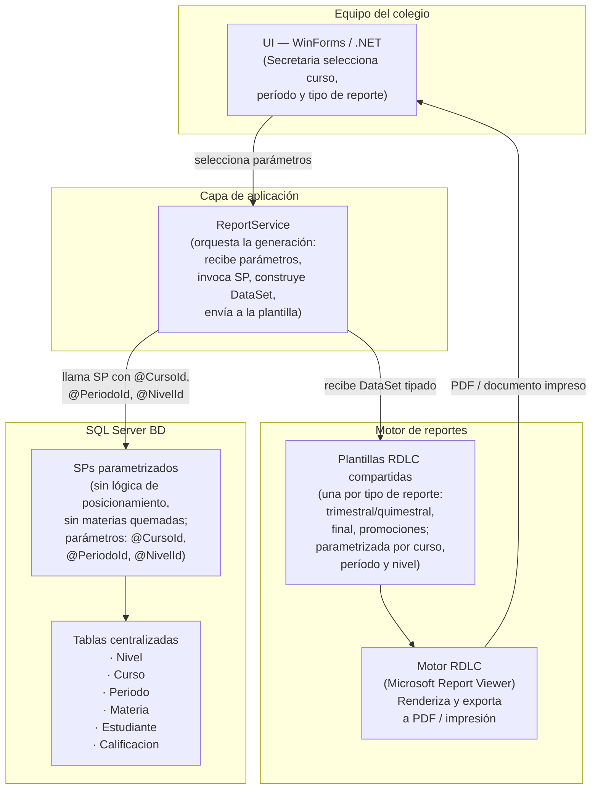

# Arquitectura — Ciencia y Fe · Ciclo 2025-2026

> Una sola decisión de simplicidad: ampliar el sistema .NET + SQL Server existente
> con un esquema centralizado y plantillas parametrizadas. Sin nuevas tecnologías.

---

## Diagrama de componentes

---

## Componentes

### UI — WinForms / .NET

**Responsabilidad:** interfaz que usa la Secretaria para seleccionar los parámetros
de un reporte (curso, período y tipo: trimestral, quimestral, final o promociones)
y lanzar la generación.

**Origen:** stack existente del colegio. No se modifica el paradigma de interfaz;
solo se añaden los controles de selección paramétrica donde antes había una
selección de archivo RDLC fijo.

**Traza:** `pain:rdlc-por-curso` · `req:R-06` · US-06

---

### ReportService

**Responsabilidad:** orquestar la generación de un reporte. Recibe los parámetros
seleccionados en la UI (CursoId, PeriodoId, TipoReporte), invoca el stored
procedure correspondiente, recibe el `DataSet` tipado con los datos de
calificaciones y nombres de materias, selecciona la plantilla RDLC correcta según
el tipo de reporte y el nivel del curso, y la pasa al Motor RDLC para su
renderizado.

Esta capa es la responsable de la lógica de selección de escala (cualitativa vs.
numérica según el nivel del curso, `req:R-05`) y de la detección de inconsistencias
antes de enviar el `DataSet` a la plantilla (criterio de aceptación de US-02:
"el sistema alerta del conflicto antes de producir el documento").

**Traza:** `pain:sp-no-mantenibles` · `req:R-05` · `req:R-06` · US-01, US-02,
US-05, US-06

---

### SQL Server BD — Tablas centralizadas

**Responsabilidad:** fuente única de verdad para todos los datos que alimentan
los reportes del ciclo 2025-2026. El esquema mínimo centralizado comprende:

| Tabla | Propósito |
|-------|-----------|
| `Nivel` | Categoría del curso: inicial, básica elemental, básica media, etc. Determina la escala de calificación. |
| `Curso` | Curso concreto (ej.: 3.° A). Referencia a `Nivel`. |
| `Periodo` | Trimestre, quimestre o período final. |
| `Materia` | Nombre oficial de la materia leído desde la BD, nunca quemado. |
| `Estudiante` | Datos del estudiante vinculados al `Curso`. |
| `Calificacion` | Valor de la calificación; referencia a `Estudiante`, `Materia` y `Periodo`. |

**Traza:** `pain:inconsistencia-bd` · `pain:materias-quemadas` · `req:R-07` ·
US-07 (prerequisito de todo el MVP)

---

### SQL Server BD — SPs parametrizados

**Responsabilidad:** encapsular las consultas de cada tipo de reporte. Reciben
parámetros (`@CursoId`, `@PeriodoId`, `@NivelId`) y retornan un `DataSet` con
los datos de calificaciones y nombres de materias directamente desde las tablas
centralizadas. No contienen lógica de posicionamiento ni texto de materias
quemado.

**Traza:** `pain:sp-no-mantenibles` · `req:R-12` · US-07

---

### Plantillas RDLC compartidas

**Responsabilidad:** definir la estructura visual y el layout de cada tipo de
reporte. Se implementan **una por tipo de reporte** (cuadro trimestral/quimestral,
cuadro final, reporte de promociones), independientemente del número de cursos.
Reciben el `DataSet` del ReportService y usan parámetros de reporte (curso,
período, nivel) para adaptar el contenido dinámicamente. Incluyen los espacios
reservados para firma del docente y sellos del colegio y del distrito (`req:R-04`).

**Traza:** `pain:rdlc-por-curso` · `pain:reportes-no-dinamicos` · `req:R-06` ·
US-04, US-06

---

### Motor RDLC — Microsoft Report Viewer

**Responsabilidad:** renderizar el `DataSet` + la plantilla RDLC y exportar el
resultado como PDF o enviarlo a impresión. Es el componente existente del sistema;
no se reemplaza (ver ADR-0001).

**Traza:** ADR-0001 · `req:R-06`

---

## Flujo principal: generación de un reporte

1. La **Secretaria** abre la aplicación WinForms y selecciona: curso (ej.: "4.° B"),
   período (ej.: "1er Trimestre 2025-2026") y tipo de reporte (ej.: "Cuadro
   trimestral").

2. La **UI** llama al **ReportService** con los parámetros seleccionados
   (`CursoId`, `PeriodoId`, `TipoReporte`).

3. El **ReportService** determina el `NivelId` del curso (necesario para la escala
   de calificación) y construye la llamada al **SP parametrizado** correspondiente.

4. El **SP parametrizado** consulta las **tablas centralizadas** y retorna un
   `DataSet` con los estudiantes del curso, sus calificaciones del período y los
   nombres de materias leídos de la tabla `Materia`.

5. El **ReportService** verifica la coherencia del `DataSet` (sin inconsistencias
   entre trimestrales y finales, cuando aplica). Si detecta un conflicto, alerta
   a la Secretaria antes de continuar.

6. El **ReportService** selecciona la **plantilla RDLC compartida** correcta según
   el tipo de reporte y pasa el `DataSet` y los parámetros de nivel al **Motor
   RDLC**.

7. El **Motor RDLC** (Report Viewer) renderiza el documento, aplicando la escala
   cualitativa o numérica según el nivel del curso, e incluyendo los espacios de
   firma y sello.

8. El documento resultante se muestra en pantalla para vista previa y se exporta
   a PDF o se envía a impresión.

---

## Decisiones clave (resumen de ADRs)

| ADR | Decisión | Motivación |
|-----|----------|------------|
| ADR-0001 | Mantener Microsoft Report Viewer / RDLC como motor de reportes | `pain:rdlc-por-curso` · `req:R-06` · stack existente .NET/SQL Server. El problema es cómo se usa RDLC, no el motor en sí. |
| ADR-0002 | Crear un esquema centralizado en SQL Server (tablas `Calificacion`, `Materia`, `Curso`, `Nivel`, `Periodo`) | `pain:inconsistencia-bd` · `pain:materias-quemadas` · `pain:sp-no-mantenibles` · `req:R-07` · US-07 |
| ADR-0003 | El MVP 2025-2026 parte con datos frescos en el esquema centralizado; los históricos se migran en una segunda fase | Supuesto no validado en MVP Canvas (riesgos ítem 1) · US-07 `notes`. Evita el riesgo de pérdida de datos históricos. |
| ADR-0004 | No contenerizar el sistema en el MVP; seguir desplegando como WinForms en los equipos del colegio | MVP Canvas (fuera de alcance: `req:R-09`) · equipo de 2 devs · fecha límite fija del ciclo escolar |

---

## Riesgos y supuestos abiertos

Los siguientes riesgos no se resuelven en el MVP. Se registran explícitamente para
que el equipo los gestione en la siguiente iteración o antes del arranque del ciclo.

### 1. Migración de datos históricos (supuesto no validado)

**Historia afectada:** US-07 (E-01)

El MVP Canvas asume que "la BD actual puede migrarse a un esquema centralizado sin
pérdida de datos históricos". No hay en el inbox ningún script de migración ni
análisis del esquema legado que valide esta afirmación. La decisión tomada en
ADR-0003 es arrancar con datos frescos para el ciclo 2025-2026.

**Acción requerida fuera del MVP:** el equipo debe analizar el esquema legado y
construir un script de migración validado con una copia de datos de prueba antes
de intentar migrar históricos a producción.

---

### 2. Escalas de comportamiento específicas del colegio (supuesto abierto de US-05)

**Historia afectada:** US-05 (E-02)

El requisito `req:R-05` menciona "escalas de comportamiento configurables por
nivel". US-05 aplica por defecto la escala MINEDUC estándar (AS / A / EP / I para
inicial y básica elemental; numérica 1-10 para básica media en adelante). No hay
evidencia en el inbox de que los valores exactos del Colegio Ciencia y Fe
coincidan con el reglamento MINEDUC estándar.

**Acción requerida antes del sprint:** validar con la Rectora o la Secretaria si
el colegio aplica exactamente la escala MINEDUC o si tiene variaciones propias.
Si hay variaciones, la tabla `Nivel` debe incluir un campo de configuración de
escala de comportamiento, o debe existir una tabla `EscalaComportamiento` separada.
Hasta que se valide, el sistema usa la escala MINEDUC estándar.

---

### 3. Carga inicial de datos del ciclo 2025-2026 (no estimada)

**Historia afectada:** US-07 (E-01), y de forma transitiva todas las demás

La estrategia de datos frescos (ADR-0003) requiere que antes de que los reportes
sean operativos, el equipo cargue en el esquema centralizado los datos del ciclo
2025-2026: niveles, cursos, períodos, materias y estudiantes. Esta tarea no está
estimada en el backlog como historia de usuario porque es una actividad de
despliegue/carga, no de desarrollo de funcionalidad. Debe planificarse como tarea
explícita antes del arranque del ciclo.

---

### 4. Formato digital de sellos del colegio y del distrito (supuesto de US-04)

**Historia afectada:** US-04 (E-04)

US-04 se implementa con un placeholder visual (área con borde) en la plantilla
RDLC cuando el colegio no provee imagen digital del sello. No hay evidencia en el
inbox de que el colegio disponga de estos activos digitales. Si no se obtienen
antes del cierre del ciclo, el documento cumple el requisito formal del espacio
reservado pero sin la imagen del sello impresa.

---

### 5. Decisiones no tomadas (open questions para iteraciones futuras)

Las siguientes decisiones no son necesarias para el MVP 2025-2026 y se registran
explícitamente como **no-decisiones**:

- **Contenerización / Docker:** evaluada y diferida (ADR-0004). Se retoma si el
  sistema crece a multi-sede.
- **Unificación sistema interno/externo (req:R-09):** fuera del alcance del MVP
  por decisión del MVP Canvas. Se evalúa tras validar la calidad de los reportes.
- **Adaptación configurable a cambios del Ministerio (req:R-13):** diferida. La
  flexibilidad total se diseña una vez que el esquema centralizado esté en
  producción y se conozca la estabilidad real del esquema MINEDUC.
- **Cumplimiento Ley de Protección de Datos (req:R-11):** diferido. No hay señal
  de auditoría urgente; se planifica como tarea de cumplimiento separada en el
  siguiente ciclo.
