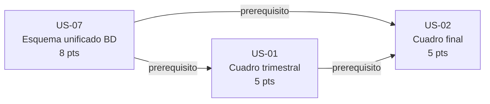

# Sprint Plan 1 — Ciencia y Fe · Ciclo 2025-2026

**Sprint Goal:** Al final del sprint, la Secretaria puede generar cuadros de calificaciones trimestrales y finales con nombres de materias leidos desde la base de datos centralizada, eliminando los errores de nomenclatura que hoy causan devoluciones del distrito.

**Capacidad:** 20 pts · **Comprometido:** 18 pts · **Sobrante:** 2 pts
**Periodo:** 2026-06-24 → 2026-07-07

---

## Historias comprometidas

### US-07 · Esquema unificado de calificaciones en la BD

**Epica:** E-01 · Fundacion de datos: esquema centralizado de calificaciones
**Como** Desarrollador, **quiero** que las calificaciones esten en un esquema unificado de la BD con identificadores de materia, curso y periodo, **para** que todos los reportes lean de la misma fuente y sean coherentes entre si.
**Estimacion:** 8 pts · **Prioridad:** 1
**Dependencias:** Ninguna
**Por que en este sprint?** Es el prerequisito tecnico absoluto del MVP: sin el esquema centralizado ninguna historia de E-02 puede leer datos coherentes ni cumplir su criterio de aceptacion.

#### Criterios de aceptacion

```gherkin
Escenario: Consulta coherente desde multiples modulos de reporte
  Dado un registro de calificacion en el esquema centralizado
  Cuando lo consulto desde cualquier modulo de reporte
  Entonces el valor y el nombre de materia son identicos en todos los documentos del mismo periodo
```

```gherkin
Escenario: Nuevo tipo de reporte sin duplicacion de tablas
  Dado el nuevo esquema centralizado
  Cuando agrego un nuevo tipo de reporte al sistema
  Entonces no se requiere duplicar tablas de calificaciones para soportarlo
```

```gherkin
Escenario: Actualizacion de nombre de materia propagada a todos los reportes
  Dado el esquema centralizado con una materia registrada
  Cuando se actualiza el nombre de esa materia en la BD
  Entonces todos los reportes del periodo reflejan el nombre actualizado sin modificar procedimientos almacenados individuales
```

---

### US-01 · Cuadro de calificaciones trimestral con nombres desde la BD

**Epica:** E-02 · Reportes de calificaciones correctos en el primer intento
**Como** Secretaria, **quiero** generar el cuadro de calificaciones trimestral de cualquier curso con los nombres de materias obtenidos de la base de datos, **para** poder enviarlo al distrito sin errores de nomenclatura.
**Estimacion:** 5 pts · **Prioridad:** 2
**Dependencias:** US-07 (incluida en este sprint)
**Por que en este sprint?** Es la segunda historia por prioridad y entrega el primer documento de cierre observable por la Secretaria: el cuadro trimestral con nombres dinamicos desde la BD. Su dependencia (US-07) se resuelve en el mismo sprint.

#### Criterios de aceptacion

```gherkin
Escenario: Nombres de materias provienen de la BD, no de texto quemado
  Dado un curso y un trimestre seleccionados
  Cuando genero el cuadro de calificaciones
  Entonces los nombres de materias coinciden exactamente con los registrados en la BD y no provienen de texto quemado en la plantilla
```

```gherkin
Escenario: Cambio de nombre de materia se refleja sin modificar plantillas
  Dado que se actualiza el nombre de una materia en la BD
  Cuando regenero el cuadro trimestral de cualquier curso
  Entonces el nuevo nombre aparece en el documento sin modificar ninguna plantilla ni procedimiento almacenado
```

```gherkin
Escenario: Cuadro incluye todos los estudiantes del curso con sus calificaciones
  Dado un curso valido registrado en la BD y un trimestre seleccionado
  Cuando genero el cuadro trimestral
  Entonces el documento incluye todos los estudiantes del curso con sus calificaciones del periodo seleccionado
```

---

### US-02 · Cuadro de calificaciones final coherente con los trimestrales

**Epica:** E-02 · Reportes de calificaciones correctos en el primer intento
**Como** Secretaria, **quiero** generar el cuadro de calificaciones final que sea coherente con los cuadros trimestrales del mismo periodo, **para** poder entregar documentos consistentes al distrito.
**Estimacion:** 5 pts · **Prioridad:** 3
**Dependencias:** US-07 (incluida en este sprint), US-01 (incluida en este sprint)
**Por que en este sprint?** Completa el par de cuadros de calificaciones (trimestral + final), que constituyen el nucleo del outcome del MVP. US-07 + US-01 + US-02 suman 18 pts, dentro de la capacidad de 20 pts. La siguiente historia por prioridad (US-05, 3 pts) elevar el total a 21 pts, superando la capacidad; US-02 es el corte natural.

#### Criterios de aceptacion

```gherkin
Escenario: Promedios del cuadro final coinciden con los cuadros trimestrales
  Dado un curso y un periodo seleccionados
  Cuando genero el cuadro final de calificaciones
  Entonces los promedios coinciden con los valores registrados en los cuadros trimestrales de ese periodo
```

```gherkin
Escenario: Alerta de conflicto antes de producir el documento
  Dado una inconsistencia detectada en la BD entre registros del periodo
  Cuando intento generar el cuadro final
  Entonces el sistema alerta del conflicto antes de producir el documento y no genera un cuadro con datos inconsistentes
```

```gherkin
Escenario: Nombres de materias identicos entre cuadro final y trimestrales
  Dado el cuadro final generado para un curso y periodo
  Cuando lo comparo con los cuadros trimestrales del mismo periodo
  Entonces los nombres de materias son identicos en ambos documentos
```

---

## Historias fuera del sprint (backlog)

| ID | Titulo | Pts | Razon |
|----|--------|-----|-------|
| US-05 | Escala de calificacion automatica por nivel | 3 | Supera la capacidad: 18 + 3 = 21 pts. Ademas, architecture.md registra un supuesto abierto sobre si el colegio aplica la escala MINEDUC estandar o tiene variaciones propias; conviene validarlo antes del desarrollo. Candidata para Sprint 2. |
| US-03 | Reporte de promociones con nombres de materias desde la BD | 5 | No entra por capacidad comprometida. Su dependencia (US-07) quedara resuelta al inicio del Sprint 2. Candidata para Sprint 2. |
| US-04 | Espacios de firma y sello en todos los reportes | 2 | No entra por capacidad comprometida. Su dependencia (US-07) quedara resuelta al inicio del Sprint 2. Bajo riesgo tecnico; puede desarrollarse en paralelo con US-03 en Sprint 2. |
| US-06 | Plantilla de reporte parametrizada y compartida por todos los cursos | 6 | No entra por capacidad comprometida. Es la historia de menor prioridad (prioridad 7) y, aunque aporta mantenibilidad a largo plazo, no bloquea la entrega de los reportes de cierre. Candidata para Sprint 2 o 3 segun capacidad. |

---

## Dependencias entre historias del sprint



---

## Riesgos del sprint

1. **Carga inicial de datos del ciclo 2025-2026 no estimada (US-07, alta urgencia):** La estrategia de datos frescos definida en ADR-0003 requiere que antes de que US-01 y US-02 sean demostrables, el equipo cargue en el esquema centralizado los datos del ciclo: niveles, cursos, periodos, materias y estudiantes. Esta tarea de despliegue/carga no esta estimada como historia de usuario. Si no se planifica como tarea explicita de la primera semana del sprint, US-01 y US-02 no tendran datos reales para su demostracion en la Review. (architecture.md — Riesgo 3)

2. **Supuesto de migracion de historicos no validado (US-07, riesgo de alcance):** El MVP Canvas asume que la BD actual puede migrarse al esquema centralizado sin perdida de datos historicos, pero no existe en el inbox ningun script de migracion ni analisis del esquema legado que valide esa afirmacion. La decision tomada en ADR-0003 es arrancar con datos frescos, lo que desvincula este riesgo del Sprint 1; sin embargo, si el equipo o el colegio deciden que los historicos son necesarios para la Review del sprint, el alcance de US-07 se amplia significativamente. Debe confirmarse antes del primer dia del sprint. (architecture.md — Riesgo 1)

3. **Deteccion de inconsistencias en US-02 depende del esquema de US-07 (riesgo de integracion intra-sprint):** El criterio de aceptacion de US-02 "el sistema alerta del conflicto antes de producir el documento" requiere que la logica de validacion en el ReportService pueda detectar discrepancias entre registros trimestrales y finales en las tablas centralizadas. Si el diseno del esquema en US-07 no incluye restricciones o indices que faciliten esa deteccion, el desarrollo de US-02 puede encontrar retrabajo tecnico en la segunda semana del sprint. Se recomienda que ambos desarrolladores alineen el diseno del esquema en el primer dia antes de separarse en las historias. (architecture.md — ReportService, US-02 criterio 2)
